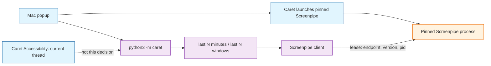

# Architecture Decision: Screenpipe Context Source

How Caret obtains last-N-minutes and last-N-windows context for “what the user has been up to,” so the rest of the app can request that data without talking to Screenpipe.

## Requirements and Constraints

Functional:

- The rest of Caret can ask for last N minutes and last N windows and get a structured record: app, title, structure if present, otherwise visible text.
- That gatherer is Screenpipe-backed. This is history, not a replacement for Caret reading the focused thread via its own Accessibility grant.
- Callers must not depend on Screenpipe URLs, tokens, or `AX*` role names.
- Screenpipe down, unreachable, or missing the history a Caret run needs is a **hard failure**. The run stops. Do not continue inference on empty context. Do not invent windows.

Quality attributes, ranked for this event:

1. Fitness — the facade exists and returns the dump shape we already proved locally.
2. Honesty with TCC and license — do not claim Caret’s Accessibility covers their binary; do not ship current Screenpipe under the MIT pin story.
3. Simplicity — pin one Screenpipe build, launch it from Caret, do not vendor their engine or stand up a second capture stack.
4. Maintainability — a teammate can debug “is Screenpipe up?” without a Rust embed.
5. Local privacy — capture stays on the machine; Caret only reads what the gatherer already stored.
6. Scale — not a factor. One laptop, one demo.

Technical constraints:

- Caret is a Swift popup that shells out to `python3 -m caret`. There is no HTTP server in the starter.
- macOS Accessibility and Screen Recording attach to a code signature. Spawning the Screenpipe CLI does not inherit Caret’s grant. Already observed on this machine.
- `packages/screenpipe` is pinned at `892199f` as a historical MIT reference. Do not advance across the later commercial license. Do not copy `ee/`.
- Current published Screenpipe is source-available commercial. Embedding it is a legal decision, not a launchd trick.
- A Screenpipe recorder is already running locally as a sidecar (`127.0.0.1:3030` + API token). The dump format and AppKit role map are proven in `.scratch/`.

In scope: where the gatherer process lives, and the Caret-facing query boundary.

Out of scope: implementing the facade, UI for the dumps, audio, embedding their desktop app, changing the Screenpipe pin.

## Components

- **Caret launcher** — starts, waits for health, and supervises the pinned Screenpipe. Owns the runtime lease (version, checksum, endpoint, PID).
- **Caret facade** — last N minutes / last N windows. Callers never see Screenpipe.
- **Screenpipe client** — talks only to the leased process. Wrong version or dead PID is a hard fail.
- **Pinned Screenpipe** — their binary, their TCC. Caret’s Accessibility does not cover it.
- **Caret Accessibility** — frontmost thread and selection. Not the gatherer.

Communication is request/response over loopback HTTP to the process Caret launched. No shared database. Caret does not embed their engine.

## Options Evaluated

- **Bundle the engine**: Vendor Screenpipe (current or the MIT pin) into `Caret.app`, sign it as Caret, run capture inside our identity.
- **Sidecar plus configured endpoint**: Users must run Screenpipe themselves. Caret is a client. Endpoint is configurable; default is loopback 3030.
- **Caret-signed helper from the MIT pin only**: A third path. Bundle *only* the frozen MIT engine as a helper we sign. Same TCC story as bundle, without the current license. Old engine, large embed, still a daemon we own.

## Analysis

| Criterion | Bundle engine | Sidecar plus endpoint | MIT-pin helper |
| --- | --- | --- | --- |
| Fitness | Yes, after a large embed and our own TCC for Screen Recording | Yes, if Screenpipe is running. Same dump we already produced | Yes, eventually, against an old API |
| TCC honesty | Works only if the binary is really Caret-signed. Launching *their* CLI still fails | Explicit: user grants Screenpipe. Caret’s grant stays for *now* | Works if we sign the helper as Caret |
| License | Current engine: blocked without a commercial license | Client to a user-installed app. We do not redistribute their engine | Allowed at `892199f` only. Must not fast-forward |
| Simplicity | Conflicts with “two processes, no server.” Adds models, ffmpeg, port fights | Smallest change. Probe health, then query | Weeks, not a weekend |
| Maintainability | We debug their Rust inside our app | “Is port 3030 up?” | Forked snapshot we do not want to maintain |
| Risk | Hard to undo once vendored. Pin policy exists to prevent this | Hard fail if sidecar is down or history is missing. Easy to add a bundle later behind the same facade | Medium: legal-ok, operationally a second product |

Key insights:

- “Bundle Screenpipe” and “inherit Caret’s Accessibility” only meet if the gatherer **is** Caret. The official CLI is not Caret.
- The facade is not optional in any winning design. Option 1 vs 2 is only about who runs the recorder.
- License plus TCC together eliminate “ship `npx screenpipe` inside the app” as a serious option.
- Configured endpoint is the right escape hatch. Forcing every user to type it is not. Default `http://127.0.0.1:3030` and `screenpipe auth token` / env cover this machine.

## Decision

### Choice Pre-Mortem

- Demo machine has no Screenpipe or too little history, so the run dies: checked. That is the intended failure. Show why it failed (sidecar down, no token, no rows in the window). Do not degrade to guesswork.
- A later teammate vendors current Screenpipe because the sidecar feels incomplete: checked. The pin note and this decision say the facade stays; the gatherer can be replaced later, the current engine must not be copied in.
- Callers use last-N history when they needed the focused Gmail thread: checked. Integrations already say current thread is Accessibility. This facade is “what they’ve been up to,” not “what is focused.”

**Selected (override 2026-09-19):** Caret launches and supervises a pinned Screenpipe version. Caret-owned facade for last-N. Do not vendor the engine. Do not depend on a user-started sidecar.

This overrides the earlier “user-run sidecar, do not spawn” line. Operator direction: launch and supervise.

**Rationale**: The approved brief is launch-and-depend. A random Screenpipe on the machine is not a pin. Bundling their current engine is still a license problem. Supervising *their* pinned binary is the path that makes the version a Caret dependency without copying source.

**Tradeoff**: Caret now owns process lifecycle. The launched binary still needs its own Accessibility and Screen Recording. Down, wrong version, or empty last-N is a hard fail. Soft-empty last-N is not a valid outcome.

## Implementation Notes

- Put `last_n_minutes(n)` and `last_n_windows(n)` on the Python CLI. Return the scratch dump shape: title, app, timestamp, structure with `role` plus AppKit `label`, or visible text.
- Caret starts the pinned binary (or confirms that exact pin is already the one it launched), waits for health, writes a lease: artifact id, checksum, expected version, endpoint, PID, ready time.
- The Python client consumes that lease. It does not rediscover an arbitrary recorder on port 3030.
- If health fails, version mismatches, auth fails, or last-N has no usable records, fail the Caret run. Structured error, non-zero CLI, no inference. Never invent windows.
- Do not open Screenpipe’s TCC panes as if they were Caret’s. Tell the user to grant the launched binary.
- Keep Caret Accessibility for “now.” Do not route thread identification through this facade.
- Do not change the Screenpipe submodule pin. Do not copy `ee/`.
- If a later licensed or MIT-pin helper is approved, it sits behind the same two functions. Callers do not change.
