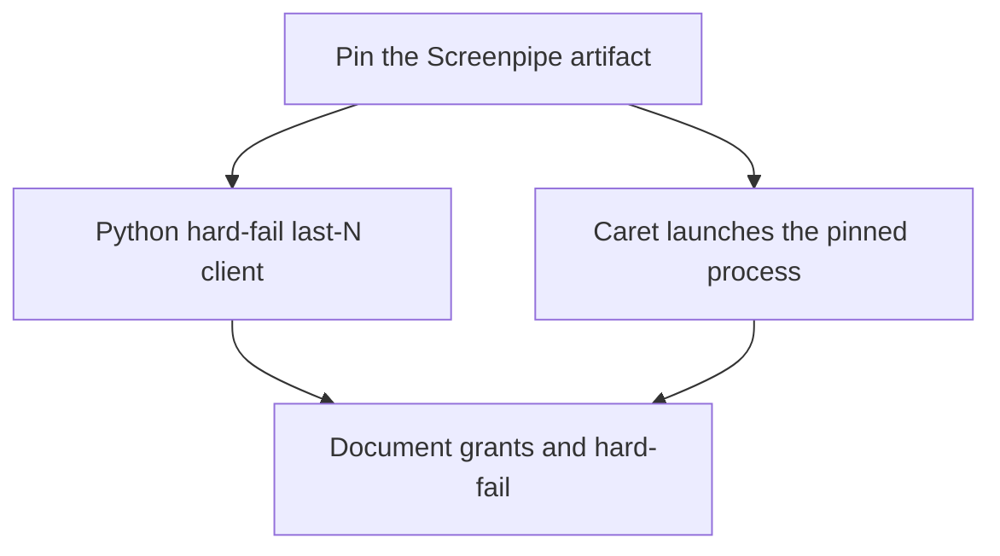

# Milestones: caret-pinned-screenpipe

## Cross-milestone invariants and constraints

- Do not vendor current Screenpipe source, advance the `892199f` pin, or copy `ee/`.
- The launched binary does not inherit Caret Accessibility. Never tell the user that Caret’s grant covers Screenpipe.
- Any run that needs history hard-fails if the gatherer is down, the version is not the pin, or last-N has no usable records. Do not invent windows.
- Callers use only Caret `last_n_minutes` / `last_n_windows`. They do not use Screenpipe URLs or `AX*` tokens.
- Milestone 1 is the only one that may change the pinned version id. Later milestones consume that pin; they do not pick a different build.
- Caret launches and supervises the pinned process. A user-started Screenpipe is not the dependency.
- The Python last-N client talks only to a launcher lease (artifact id, checksum, expected version, endpoint, PID, ready time). It must not rediscover an arbitrary recorder on port 3030.

## Execution Order

- [ ] Pin the Screenpipe artifact Caret will launch
- [ ] Add a Python last-N client that requires the pin and hard-fails
- [ ] Launch and supervise the pinned Screenpipe from Caret.app
- [ ] Document TCC for the launched binary and the hard-fail contract

## Per-milestone done and risks

### Pin the Screenpipe artifact Caret will launch
- Done: A tracked pin names the version, how Caret obtains the binary, the health/version string a matching gatherer must report, and the lease field list. License checked against the MIT-pin policy.
- Risks: Picking current commercial source or moving `packages/screenpipe` across the license change.

### Add a Python last-N client that requires the pin and hard-fails
- Done: `python3 -m caret` reads a lease and returns last N minutes and last N windows in the agreed shape, or exits non-zero if the lease is missing, health/version/PID fail, or rows are empty. Role labels are AppKit names, not raw `AX*` in caller-facing fields.
- Risks: Soft-empty success; rediscovering port 3030; inventing windows.

### Launch and supervise the pinned Screenpipe from Caret.app
- Done: Opening a history-backed Caret session starts the pinned binary (or confirms it is already that pin), waits for health, writes the lease, and fails the session if it does not come up. Caret does not claim its Accessibility covers that process.
- Risks: Spawning an unpinned `npx screenpipe`; fighting a second recorder; implying TCC piggyback.

### Document TCC for the launched binary and the hard-fail contract
- Done: README or integrations doc states which binary the user grants, that Caret launches that pin, and that missing history aborts inference.
- Risks: Instructing users to grant Caret instead of the launched Screenpipe binary.
