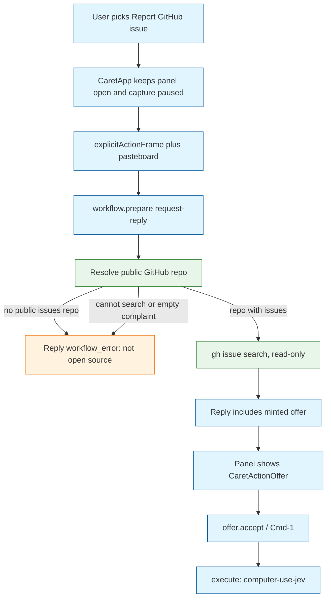
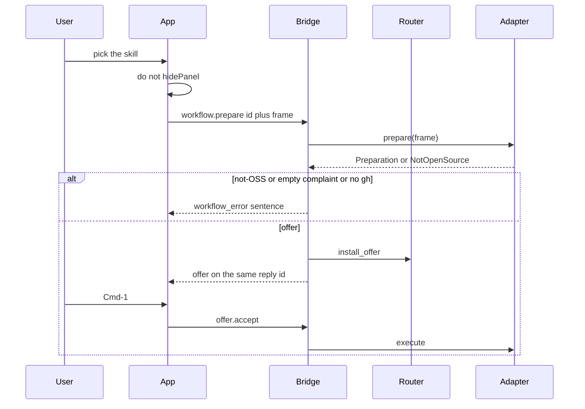

# Task: caret-report-github-issue

* Task ID: caret-report-github-issue
* Complexity: Level 3
* Type: feature

A Caret skill the user can invoke from the current app to pause and report a problem. The workflow understands the complaint from the existing context frame, finds a public GitHub repository it can search, and offers either a new issue or a comment on a match. Writes go through computer-use-jev. Non-GitHub apps fail fast with an explicit not-open-source message.

Preflight 1 dropped the parallel CLI accept protocol. Preflight 2 dropped ambient `submit` / `failed` events for this invoke. Explicit invoke is a `workflow.prepare` request-reply that returns the minted offer or a typed error. Accept is still `offer.accept`.

## Pinned Info

### Report flow

### Explicit prepare does not use the ambient queue

## Component Analysis

### Affected Components
- `caret/live_workflows/report_issue.py` (new): WorkflowAdapter. `prepare` is `gh`-only and read-only. Empty complaint, missing `gh`, or not-OSS raise `WorkflowError` with a visible sentence (not a `missing_inputs` offer). `execute` runs computer-use-jev from pending state only, and refuses a write when the frame is marked synthetic/sample. `availability` may report Jev missing; `prepare_named` must not use a blanket `availability` gate.
- `caret/live_workflows/github.py` (new): Injectable `gh` ports. Display name is `SourceRecord(name="frontmost_app").detail`. Bundle-id tail is a fallback search token only.
- `caret/router.py`: New `install_offer(frame, offer)` updates revision and target, sets `_offer`, does **not** set `_pending`, does **not** take the ambient in-flight slot, and bypasses cadence / unchanged-signature / suppression. Dedicated tests that a later `pump`/`take_due` does not evaluate that frame through the judge.
- `caret/engine.py`: `prepare_named(workflow_id, frame)` calls the adapter, then `install_offer`. It does not call `submit`. Not-OSS is a raised `WorkflowError`, not `complete_failure`.
- `caret/bridge.py`: `workflow.prepare` is request-reply. Success: `{offer: ...}` on the same id. Failure: coded `workflow_error` with the sentence. No `failed` event. `build_registry` **registers `ReportGithubIssueWorkflow()` as a built-in** and skips its `workflows.json` seed. `adapters()` / `--adapter` is not the happy-path load.
- `caret/live_workflows/actions.py` and `__init__.py`: mapping, `_LAZY`, `adapters()` for the live package; still required so `test_the_action_table_matches_the_registered_ids` holds.
- `caret/workflows.json`, skill JSON, skill note: catalog + picker identity. Not a gateway transform.
- `apps/mac/Sources/Caret/CaretApp.swift`: For this action id, `onRun` must **not** `hidePanel`. Keep the panel visible and capture paused until the reply is rendered (offer rows or the not-OSS sentence via `failSkillPreview` / a status row, **not** `backendStatus`).
- `apps/mac/Sources/CaretCore/FocusedTargetCapture.swift`: `explicitActionFrame()` always increments revision. Focused field if present, else empty `nearby_text`. **Always read `NSPasteboard.general` for this frame**, even when `clipboardEnabled` is false. Attach `frontmost_app` localized name. Do not depend on Screenpipe history for the Mac happy path.
- `apps/mac/Sources/Caret/CoreBridgeProvider.swift` and `CoreBridgeClient.swift`: `prepareWorkflow` awaits the reply and installs the returned offer into `actionOffers`. `runAction` for an offer minted from a no-field explicit frame revalidates **pid and bundle_id only**; it must not require `liveTarget` of a text field.
- `apps/mac/Sources/Caret/SkillActionRunner.swift`: This id calls `prepareWorkflow`. No gateway apply.
- `docs/bridge-protocol.md`, `docs/live-workflow-adapters.md`, `docs/input-pipeline.md`.

### Cross-Module Dependencies
- Picker → keep panel → `prepareWorkflow` → `workflow.prepare` reply → `actionOffers` → Cmd-1 → `offer.accept` → Jev
- Ambient `context.update` / `PatternJudge` must not see this frame as pending

### Boundary Changes
- New built-in workflow on the default Mac bridge
- New bridge method `workflow.prepare` (request-reply)
- New `Router.install_offer`
- `CaretApp.onRun` exception for this action id
- `runAction` no-field accept check
- Explicit-frame pasteboard read independent of ambient clipboard

### Invariants and Constraints
- `prepare` must not send, write, or navigate
- `execute` only after `offer.accept` on a current offer
- Do not invent a repo, issue, or fact
- Writes only through computer-use-jev from accepted pending payload
- Not-OSS / empty complaint / no `gh`: `workflow_error` reply, panel stays open, inline completions stay up
- Fail-fast comment names a later non-GitHub tracker hook
- No GitHub REST client, no `--frame` CLI, no `failed` event for this invoke
- No CaretCLI source-string test

## Open Questions

- [x] GitHub I/O → `gh` search in prepare; Jev write after accept
- [x] Invoke → picker + `workflow.prepare` request-reply + existing `offer.accept`
- [x] App → repo → evidenced URL or `gh search` with `frontmost_app`
- [x] Mac frame → `explicitActionFrame` + pasteboard, even when ambient clipboard is off
- [x] Accept without a text field → revalidate pid/bundle only
- [x] Default registry → built-in in `build_registry`

## Test Plan (TDD)

### Behaviors to Verify

- Evidenced GitHub URL wins; else `frontmost_app` + `gh search`; else `WorkflowError` with the open-source sentence
- No match → new-issue offer in the **reply**; match → summary + comment recommendation
- Empty complaint or missing `gh` → `workflow_error`, no offer
- `install_offer` then `take_due` returns None for that frame; `pump` does not call the judge
- `workflow.prepare` reply contains the offer; no `failed` event; not-OSS is `workflow_error`
- `offer.accept` runs Jev once; prepare did not spawn Jev
- Tamper / cancel / expiry → execute fails
- Missing Jev: prepare reply still succeeds; execute fails
- `build_registry()` without `--adapter` has `report-github-issue` as the real adapter, not `UnavailableWorkflow`
- Action id is not a gateway skill
- `explicitActionFrame` with clipboardEnabled false still has pasteboard text when the pasteboard has text
- No-field accept: pid/bundle match succeeds; pid mismatch refuses
- Execute refuses a synthetic/sample frame

### Test Infrastructure

- `tests/test_report_issue.py`, `tests/test_report_issue_workflow.py`
- extend `tests/test_router.py` for `install_offer` vs `take_due`
- extend `tests/test_bridge.py` for request-reply and no `failed` event
- extend `tests/test_engine.py` for `prepare_named` without `submit`
- extend `tests/test_live_workflows.py` and `tests/test_skill_action.py`
- `apps/mac/Tests/CaretCoreTests/` for `explicitActionFrame` pasteboard-on and no-field snapshot
- `apps/mac/Tests/` for `runAction` pid/bundle-only accept if an existing CoreBridgeProvider test host can inject capture
- Do not add a SkillActionRunner source-string test

## Implementation Plan

### 1. GitHub read port — executable

- Files: `caret/live_workflows/github.py`, `tests/test_report_issue.py`

1. Stub tests: URL, `frontmost_app`, not-OSS, match, empty complaint
2. Stub interface: extract/resolve/search/recommend/complaint helpers and `NotOpenSource`
3. Write tests and run red
4. Write code and run green

### 2. Workflow adapter — executable

- Files: `caret/live_workflows/report_issue.py`, `tests/test_report_issue_workflow.py`

1. Stub tests: prepare does not spawn Jev; not-OSS and empty complaint raise; execute once; synthetic frame refused
2. Stub interface: `ReportGithubIssueWorkflow`
3. Write tests and run red
4. Write code and run green

### 3. Built-in registration — executable

- Files: `caret/bridge.py`, `caret/workflows.json`, `caret/live_workflows/actions.py`, `caret/live_workflows/__init__.py`, skill JSON/note, `tests/test_bridge.py`, `tests/test_live_workflows.py`

1. Stub tests: `build_registry()` without `--adapter` returns this adapter; seed is skipped
2. Stub interface: register + skip
3. Write tests and run red
4. Write code and run green

### 4. install_offer and prepare_named — executable

- Files: `caret/router.py`, `caret/engine.py`, `caret/bridge.py`, `docs/bridge-protocol.md`, `tests/test_router.py`, `tests/test_engine.py`, `tests/test_bridge.py`

1. Stub tests: `install_offer` leaves `_pending` empty; `take_due` is None; `workflow.prepare` returns offer or `workflow_error`; no `failed` event
2. Stub interface: `Router.install_offer`, `Engine.prepare_named`, `workflow.prepare`
3. Write tests and run red
4. Write code and run green

### 5. Mac picker, panel, frame, accept — executable

- Files: `apps/mac/Sources/Caret/CaretApp.swift`, `FocusedTargetCapture.swift`, `CoreBridgeClient.swift`, `CoreBridgeProvider.swift`, `SkillActionRunner.swift`, existing CaretCore tests

1. Stub tests: `explicitActionFrame` reads pasteboard when `clipboardEnabled` is false; no-field snapshot is legal; `runAction` accepts pid/bundle match without `liveTarget`; client encodes `workflow.prepare`
2. Stub interface: `explicitActionFrame`, `prepareWorkflow`, `onRun` keep-panel branch, no-field accept
3. Write tests and run red
4. Write code and run green: panel stays open; reply offer is shown; not-OSS uses `failSkillPreview` / status row, not `backendStatus`

### 6. Docs — prose/policy

- Files: `docs/bridge-protocol.md`, `docs/live-workflow-adapters.md`, `docs/input-pipeline.md`
- No tests: prose/policy artifact

1. Document `workflow.prepare` request-reply, built-in registration, fail-fast, Jev execute

## Technology Validation

No new technology — validation not required.

## Challenges and Mitigations

- Ambient pump race: solved by `install_offer` + no `submit`.
- `failed` event poisoning completions: solved by request-reply `workflow_error`.
- Hidden accept UI: `CaretApp.onRun` keeps the panel up for this id.
- Default launch missing the adapter: built-in in `build_registry`.
- Clipboard-only / no-field accept: pasteboard always read; pid/bundle revalidate.

## Pre-Mortem

- Used `complete_failure` for not-OSS again: tests assert no `failed` event.
- Registered only via `--adapter`: `build_registry()` test without extra specs.
- Hid the panel then waited for an offer event: panel stay is in unit 5 and `CaretApp.swift`.
- Relied on Screenpipe history on Mac: complaint is nearby_text + pasteboard + `frontmost_app` only.

## Status

- [x] Component analysis complete
- [x] Open questions resolved
- [x] Test planning complete (TDD)
- [x] Implementation plan complete
- [x] Technology validation complete
- [x] Pre-Mortem complete
- [ ] Preflight
- [ ] Build
- [ ] QA
