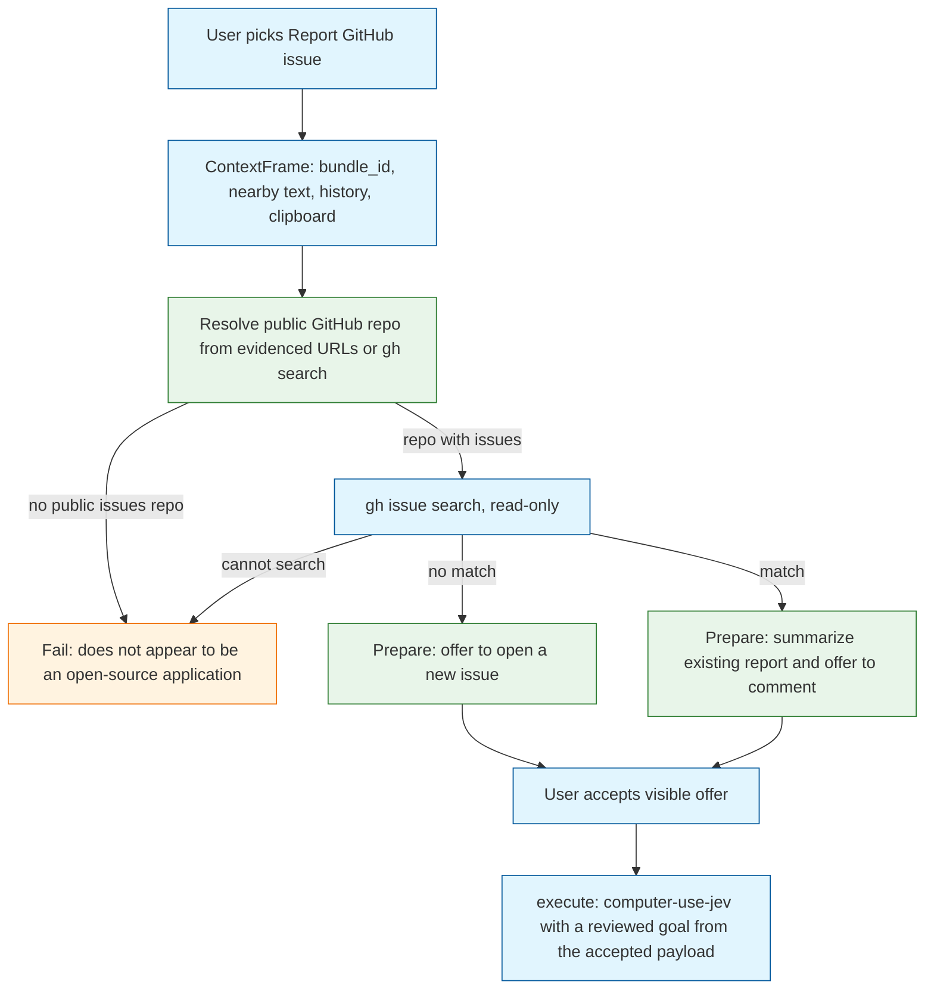
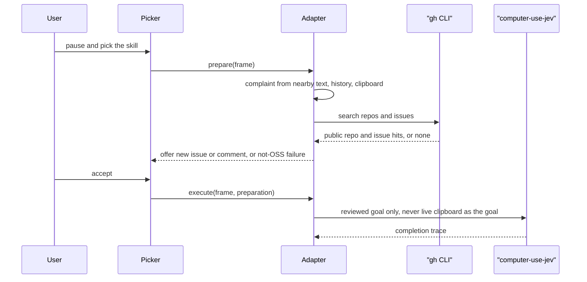

# Task: caret-report-github-issue

* Task ID: caret-report-github-issue
* Complexity: Level 3
* Type: feature

A Caret skill the user can invoke from the current app to pause and report a problem. The workflow understands the complaint from the existing context frame, finds a public GitHub repository it can search, and offers either a new issue or a comment on a match. Writes go through computer-use-jev. Non-GitHub apps fail fast with an explicit not-open-source message.

## Pinned Info

### Report flow

The user-visible path and the prepare/execute split. Pin this because every implementation step has to stay on the correct side of "prepare does not navigate."

### Why write is Jev and search is gh

## Component Analysis

### Affected Components
- `caret/live_workflows/report_issue.py` (new): WorkflowAdapter. `availability` reports whether `gh` can search and whether the Jev binary is configured for a later write. `prepare` is read-only: resolve repo, search issues, build the offer. `execute` spawns computer-use-jev the same way `NativeComputerUseWorkflow` does, with a goal taken only from the accepted pending payload.
- `caret/live_workflows/github.py` (new): Small injectable ports for `gh` repo/issue search and for turning a frame into a complaint string. No urllib GitHub client. Default implementation shells out to `gh`. Tests inject fakes.
- `caret/live_workflows/actions.py`: Map `report-github-issue` onto the new workflow ID and adapter class path.
- `caret/live_workflows/__init__.py`: Lazy-export the new adapter.
- `caret/workflows.json`: Add the seed so the catalog is complete.
- `caret/skills/report-github-issue/default.json` and `caret/notes/skills/report-github-issue.md`: The skill the user can put in. The note is the reviewed procedure Jev follows; it is not a Vercel gateway text transform.
- `caret/adapters/native_computer_use.py`: Reuse the spawn/timeout/trace rules. Extract only if a shared helper is the shorter path; otherwise copy the proven bounds (8 steps, 120s, last-4 evidence, never report timeout as completion).
- `caret/__main__.py`: Add `report-issue` CLI for explicit invoke and for the Mac picker, parallel to `run-action`.
- `caret/skill_action.py`: Do **not** add this ID to `GATEWAY_SKILL_ACTION_IDS`.
- `apps/mac/Sources/Caret/SkillActionRunner.swift`: Today non-gateway IDs log and return. This ID must call the new CLI instead of the gateway path.
- `apps/mac/Sources/Caret/CaretCLI.swift`: Add the `report-issue` invocation, same env/PATH pattern as `runAction`.
- `docs/live-workflow-adapters.md` and `docs/input-pipeline.md` if the implemented-vs-seeded line changes.

### Cross-Module Dependencies
- Skill picker → `SkillActionRunner` → `CaretCLI` → `python3 -m caret report-issue` → `ReportGithubIssueWorkflow.prepare` / `.execute`
- Ambient judge → `Engine._offer_action` → same adapter, only if `availability` is true
- `prepare` → `github.py` (`gh`) → issue list and repo identity
- `execute` → computer-use-jev binary via `CARET_COMPUTER_USE_JEV` and `TYPESAFE_API_KEY`
- ContextFrame is the only complaint source. No new chat UI.

### Boundary Changes
- New workflow id `report-github-issue` in `workflows.json`, `ACTION_WORKFLOWS`, and the skill note id. Public catalog change.
- New CLI command `report-issue`. Public CLI change.
- No new bridge method. Explicit invoke uses the existing skill-run process boundary, not a new `workflow.prepare` RPC.
- `SkillActionRunner` grows one non-gateway branch. That is a behavior change on the picker.

### Invariants and Constraints
- `prepare` must not send, write, or navigate.
- `execute` must not run until the user accepts a current offer.
- Failed or missing sources are dropped. Do not invent a repo, issue, or fact.
- A GitHub write happens only through computer-use-jev with a reviewed goal built from the accepted payload. Clipboard and ambient text must not become the goal.
- If the app is not a public GitHub repository whose issues we can search, fail immediately and say it does not appear to be an open-source application.
- The fail-fast site keeps a code comment for a later non-GitHub canonical tracker lookup. That path is not implemented.
- No new Python dependency. `gh` is an optional host tool; tests inject it.
- Do not add this action to the Vercel gateway skill set.
- Do not use Jev's browser-action types as a second browser engine. Driving the user's already-installed browser via Accessibility is native computer use, the same class as activating Calendar.

## Open Questions

- [x] How do we talk to GitHub without inventing a client? → Resolved: `gh` for read-only search in `prepare`; computer-use-jev for the accepted write. No REST client. Operator constraint 2026-09-19.
- [x] How is the skill invoked? → Resolved: skill note + JSON so it appears in the picker; `SkillActionRunner` calls `python3 -m caret report-issue`; the same adapter stays registered for the ambient ACTION path.
- [x] How do we map an app to a repo? → Resolved: evidenced `github.com/owner/repo` in the frame first; else `gh search repos` from the app name on the frame; else fail-fast not-OSS. No curated bundle-id table.

## Test Plan (TDD)

### Behaviors to Verify

- Complaint from frame: nearby text, history, and clipboard → one complaint string; empty frame → `needs_input`, not an invented complaint
- Evidenced GitHub URL in clipboard or history → that owner/repo is used
- No evidenced URL, `gh search repos` returns a public repo with issues → that repo is used
- No public issues repo, or `gh` cannot search → fail with an explicit not-open-source message; no offer to write
- `gh issue search` returns no match → prepare title/effect offer a new issue; execute is not called
- `gh issue search` returns a match → prepare summarizes that issue's title/body and recommends comment when the complaint adds details not already in the issue text
- Match with no new details → summarize and recommend not commenting
- User accepts new-issue offer → Jev is spawned with a reviewed "open new issue" goal that includes only the prepared title/body/repo; prepare did not spawn Jev
- User accepts comment offer → Jev is spawned with a reviewed "comment on issue N" goal from the pending payload
- Changed frame, expired or tampered preparation, or cancel → execute fails and Jev does not start
- Missing `gh` → availability or prepare fails with a visible reason; nothing is invented
- Missing Jev binary or `TYPESAFE_API_KEY` → prepare can still succeed (search is `gh`); execute fails with the same class of reason as `NativeComputerUseWorkflow`
- Action id is not in `GATEWAY_SKILL_ACTION_IDS`; `complete_skill_action("report-github-issue", ...)` still rejects
- `workflow_for_action("report-github-issue")` returns the workflow id
- CLI `report-issue` prints prepare JSON and exits 0 on a successful offer, non-zero on not-OSS
- Picker path: `SkillActionRunner` for this id does not take the gateway branch

### Edge Cases

- Multiple `gh` repo hits: use the first public repo with issues enabled; do not guess among the rest
- Issues disabled on an otherwise public repo → not-OSS fail
- Secure field / excluded app / no Accessibility → availability false, same as other native workflows
- Fixture/sample mode must not become a real GitHub write

### Test Infrastructure

- Framework: `unittest` under `tests/`
- Test location: `tests/`
- Conventions: inject clocks, environ, and subprocess stand-ins; use `support.frame` / `live_support.frame`; no live GitHub or live Jev
- New test files:
  - `tests/test_report_issue.py` — resolve, search, match, fail-fast
  - `tests/test_report_issue_workflow.py` — adapter prepare/execute/Jev spawn
  - extend `tests/test_skill_action.py` — still rejects this id as a gateway action
  - extend `tests/test_live_workflows.py` — `ACTION_WORKFLOWS` mapping
  - `apps/mac/Tests/` — SkillActionRunner / CaretCLI branch if a focused test already has a home; do not add a change-detector

### Integration Tests

- Adapter + fake `gh` + fake Jev binary: prepare then execute once, second execute fails
- CLI prepare against a frame JSON fixture with a synthetic github URL and a fake `gh`

## Implementation Plan

### 1. GitHub read port and fail-fast — executable

- Files: `caret/live_workflows/github.py`, `tests/test_report_issue.py`

1. Stub tests: empty cases for evidenced URL, `gh` repo search, no-repo fail, issue match vs no-match, cannot-search fail
2. Stub interface: `extract_github_refs(frame)`, `resolve_repo(frame, searcher)`, `search_issues(repo, complaint, searcher)`, `recommend(complaint, issue)`, `NotOpenSource` error with the user-facing sentence
3. Write tests and run red: assert the fail message names "open-source"; assert no invented repo when searcher returns nothing; assert comment recommended only when complaint has tokens absent from the issue
4. Write code and run green: parse `github.com/owner/repo` from clipboard, history, nearby text; call injected searcher; fail-fast with a comment that a later hook may look up a non-GitHub tracker

### 2. Workflow adapter — executable

- Files: `caret/live_workflows/report_issue.py`, `tests/test_report_issue_workflow.py`
- Creative ref: operator bias to existing computer use

1. Stub tests: prepare does not spawn Jev; not-OSS prepare is `needs_input` or a failed availability, never a write offer; execute runs the fake binary once with `-goal` from the pending payload
2. Stub interface: `ReportGithubIssueWorkflow` with `descriptor.id = "report-github-issue"`, `execution_method = "computer-use-jev"`
3. Write tests and run red: same bounds as `NativeComputerUseTests` (timeout, tamper, cancel, 8-step cap)
4. Write code and run green: `prepare` calls the github port; `execute` copies the proven Jev spawn from `NativeComputerUseWorkflow` and uses two reviewed goal templates (new issue vs comment) filled only from pending state

### 3. Registration and skill files — executable for the mapping, prose for the note

- Files: `caret/live_workflows/actions.py`, `caret/live_workflows/__init__.py`, `caret/workflows.json`, `caret/skills/report-github-issue/default.json`, `caret/notes/skills/report-github-issue.md`, `tests/test_live_workflows.py`, `tests/test_skill_action.py`

1. Stub tests: `workflow_for_action("report-github-issue")`; gateway reject
2. Stub interface: mapping entries and empty skill JSON/note
3. Write tests and run red
4. Write code and run green: wire mapping and lazy export; skill JSON name/description; note body is the Jev procedure (find repo, search issues, open or comment, say so if not OSS)

### 4. CLI — executable

- Files: `caret/__main__.py`, `tests/test_report_issue.py` or `tests/test_report_issue_cli.py`

1. Stub tests: `report-issue --frame <json>` prints prepare JSON; not-OSS exits non-zero with the explicit sentence
2. Stub interface: argparse subcommand
3. Write tests and run red
4. Write code and run green: construct the adapter with injectable searcher/environ; print JSON; `--accept` only after a successful prepare in that process if we keep it one-shot, or print the offer and require a second invocation with the token — prefer one-process prepare-only for the picker preview, and a `--accept` that re-prepares and executes only when the printed offer digest still matches

### 5. Mac picker hook — executable

- Files: `apps/mac/Sources/Caret/SkillActionRunner.swift`, `apps/mac/Sources/Caret/CaretCLI.swift`

1. Stub tests: if there is an existing CaretCLI test host, add a case that this action id is not sent to `run-action`; otherwise verify with a small Swift test next to `CaretCLI` tests
2. Stub interface: `CaretCLI.reportIssue(...)` and a `SkillActionRunner` branch
3. Write tests and run red
4. Write code and run green: this action id calls `report-issue` with the current complaint/bundle context; show the returned offer or the not-OSS sentence; do not apply gateway text replacement

### 6. Docs — prose/policy

- Files: `docs/live-workflow-adapters.md`
- No tests: prose/policy artifact

1. Add a `report-github-issue` section: prepare is `gh` read-only, execute is computer-use-jev, fail-fast for non-OSS
2. Do not claim Skyvern files GitHub issues

## Technology Validation

No new technology — validation not required. `gh` is already used in this repo's contributor workflow. computer-use-jev is already wired by `NativeComputerUseWorkflow`. No new Python packages.

## Challenges and Mitigations

- Picker still no-ops non-gateway actions: Step 5 is required, not optional. Without it the skill appears but does nothing.
- `prepare` must not navigate: issue search stays on `gh`. If `gh` is missing, fail visibly.
- Jev-as-browser-driver vs Skyvern ownership: the goal drives the user's existing browser via Accessibility, not Jev's browser-action types. If preflight rejects that reading, cut execute to "Jev opens the prepared GitHub URL" and leave form submit as a follow-up, still without a REST write.
- Live `gh` in CI: never. Inject the searcher. CI has no GitHub issue write.
- Complaint quality: the frame may be empty. Then `needs_input`, not a guessed bug.
- Sam's two demo workflows: this is a third seed the operator asked for. Do not change `book-calendar-link` or `book-flight` behavior.

## Pre-Mortem

- Built a GitHub HTTP client because `gh` felt thin: plan already forbids it. If someone reaches for urllib, stop.
- Skill was implemented as a gateway text transform: the user would get rewritten prose in the field, not a GitHub offer. Mapping and `GATEWAY_SKILL_ACTION_IDS` tests exist to catch that.
- Search happened inside Jev during prepare: that would navigate before accept. Already covered by the prepare invariant and the sequence diagram.
- Repo resolution invented a bundle-id table that goes stale: already covered — evidence or `gh search`, else fail.
- Swift hook slipped and only the CLI worked: the demo would not match "from any application." Step 5 stays in scope.

## Status

- [x] Component analysis complete
- [x] Open questions resolved
- [x] Test planning complete (TDD)
- [x] Implementation plan complete
- [x] Technology validation complete
- [x] Pre-Mortem complete
- [ ] Preflight
- [ ] Build
- [ ] QA
