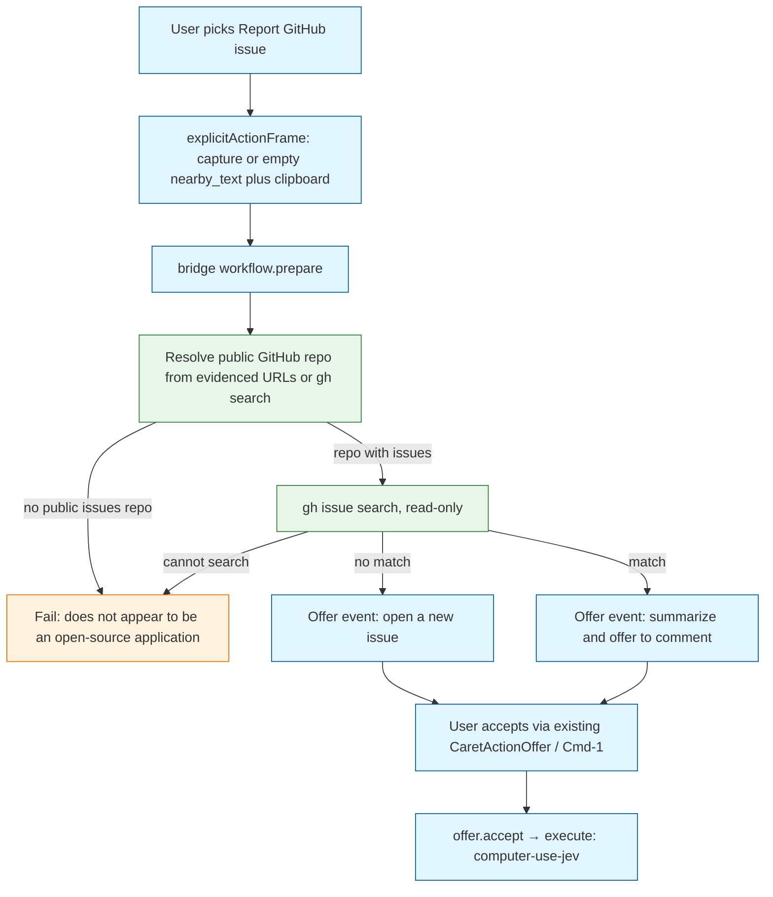
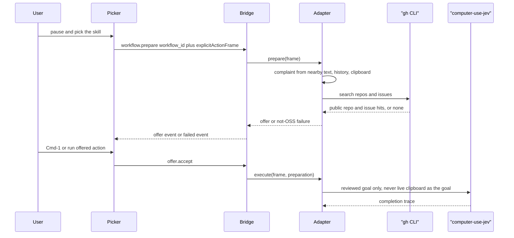

# Task: caret-report-github-issue

* Task ID: caret-report-github-issue
* Complexity: Level 3
* Type: feature

A Caret skill the user can invoke from the current app to pause and report a problem. The workflow understands the complaint from the existing context frame, finds a public GitHub repository it can search, and offers either a new issue or a comment on a match. Writes go through computer-use-jev. Non-GitHub apps fail fast with an explicit not-open-source message.

Preflight 1 (`FAIL (fixable)`) dropped the parallel `report-issue --frame` / `--accept` picker protocol. Explicit invoke prepares on the long-lived bridge and reuses `CaretActionOffer` + `offer.accept` / Cmd-1.

## Pinned Info

### Report flow

The user-visible path and the prepare/execute split. Pin this because every implementation step has to stay on the correct side of "prepare does not navigate."

### Why write is Jev and search is gh

## Component Analysis

### Affected Components
- `caret/live_workflows/report_issue.py` (new): WorkflowAdapter. `availability` may report Jev missing so the ambient judge is not offered a write it cannot complete. `prepare` requires `gh` only and is read-only. `execute` spawns computer-use-jev the same way `NativeComputerUseWorkflow` does, with a goal taken only from the accepted pending payload. Empty complaint → `Preparation.missing_inputs`. Not-OSS → `WorkflowError` with the explicit sentence, never a write offer.
- `caret/live_workflows/github.py` (new): Injectable `gh` ports. App name for `gh search repos` is `SourceRecord(name="frontmost_app").detail` (macOS localized name). Fallback search token is the last dotted segment of `bundle_id`, labeled as a bundle-id tail, not a display name. No urllib GitHub client.
- `caret/engine.py`: `prepare_named(workflow_id, frame)` submits the frame, calls that adapter's `prepare`, publishes via `router.complete_offer`. Does not ask the judge.
- `caret/bridge.py`: New method `workflow.prepare` with `workflow_id` and `frame`. Success publishes the normal `offer` event. Not-OSS is a `failed` event plus a coded reply, not an offer.
- `caret/live_workflows/actions.py`: Map `report-github-issue`; add the class to `adapters()` and `ADAPTER_CLASS_PATHS`.
- `caret/live_workflows/__init__.py`: Add the adapter to `_LAZY`.
- `caret/workflows.json`: Add the seed. `seeds_from_catalog` must skip this id so it does not become `UnavailableWorkflow`.
- `caret/skills/report-github-issue/default.json` and `caret/notes/skills/report-github-issue.md`: The skill the user can put in. Not a Vercel gateway transform.
- `caret/adapters/native_computer_use.py`: Reuse spawn/timeout/trace rules. Extract a helper only if that is shorter.
- `caret/skill_action.py`: Do **not** add this ID to `GATEWAY_SKILL_ACTION_IDS`.
- `apps/mac/Sources/CaretCore/FocusedTargetCapture.swift`: Add `explicitActionFrame()` that always increments revision. If a supported field is focused, use that snapshot. If capture is suppressed (no field, unsupported role), still return a legal snapshot: empty `nearby_text`, caret 0, frontmost pid/bundle_id, stable window/element tokens. Always attach clipboard, permissions, and `SourceRecord(name: "frontmost_app", detail: localizedName)`.
- `apps/mac/Sources/CaretCore/CoreBridgeClient.swift` and `docs/bridge-protocol.md`: `workflow.prepare`.
- `apps/mac/Sources/Caret/CoreBridgeProvider.swift`: `prepareWorkflow(id:)` builds the frame from `explicitActionFrame()` and sends `workflow.prepare`. Existing `onActionOffer` / `runAction` / `offer.accept` handle accept.
- `apps/mac/Sources/Caret/SkillActionRunner.swift`: This action id calls `prepareWorkflow`. It does not call `run-action` and does not apply gateway text replacement. No second confirm sheet.
- `docs/live-workflow-adapters.md` and the implemented-vs-seeded line in `docs/input-pipeline.md`.

### Cross-Module Dependencies
- Skill picker → `SkillActionRunner` → `CoreBridgeProvider.prepareWorkflow` → `workflow.prepare` → `ReportGithubIssueWorkflow.prepare`
- Visible offer → existing `CaretActionOffer` / Cmd-1 → `offer.accept` → `execute`
- `prepare` → `github.py` (`gh`)
- `execute` → computer-use-jev
- Ambient judge is **not** the happy path (`--judge pattern` will not select this). Registration still exists so `--adapter` can load it.

### Boundary Changes
- New workflow id `report-github-issue` in the catalog.
- New bridge method `workflow.prepare`. Public protocol change.
- `FocusedTargetCapture.explicitActionFrame()` so an empty field plus clipboard is still a legal `ContextFrame`.
- No new Python dependency. No `report-issue` CLI on the picker path.

### Invariants and Constraints
- `prepare` must not send, write, or navigate.
- `execute` must not run until the user accepts a current offer through the existing accept path.
- Failed or missing sources are dropped. Do not invent a repo, issue, or fact.
- A GitHub write happens only through computer-use-jev with a reviewed goal built from the accepted payload.
- If the app is not a public GitHub repository whose issues we can search, fail immediately and say it does not appear to be an open-source application.
- The fail-fast site keeps a code comment for a later non-GitHub canonical tracker lookup. That path is not implemented.
- Empty complaint is `Preparation.missing_inputs`, not a write offer. Accept then returns `needs_input`.
- Missing Jev / `TYPESAFE_API_KEY`: prepare may succeed; execute fails with the same class of reason as `NativeComputerUseWorkflow`.
- Do not add this action to the Vercel gateway skill set.
- Do not add a CaretCLI source-string test. Python adapter and bridge tests cover the seam.

## Open Questions

- [x] How do we talk to GitHub without inventing a client? → `gh` for read-only search in `prepare`; computer-use-jev for the accepted write.
- [x] How is the skill invoked? → Skill note + JSON in the picker. `SkillActionRunner` calls `workflow.prepare`. Accept is existing `offer.accept` / Cmd-1. Preflight 1.
- [x] How do we map an app to a repo? → Evidenced `github.com/owner/repo` first; else `gh search repos` using `frontmost_app` localized name; else fail-fast not-OSS.
- [x] How does Mac build a legal frame without `--frame`? → `explicitActionFrame()` from `FocusedTargetCapture`, same Codable `ContextFrame` the bridge already sends. Preflight 1.

## Test Plan (TDD)

### Behaviors to Verify

- Complaint from frame: nearby text, history, and clipboard → one complaint string; empty complaint → `Preparation.missing_inputs`, not an invented complaint
- Evidenced GitHub URL in clipboard or history → that owner/repo is used
- No evidenced URL, `gh search repos` with `frontmost_app` detail → that repo is used
- No public issues repo, or `gh` cannot search → `WorkflowError` / failed prepare with the explicit not-open-source sentence; no offer event
- `gh issue search` returns no match → offer to open a new issue
- `gh issue search` returns a match → offer summarizes that issue and recommends comment when the complaint adds details not already in the issue text
- Match with no new details → summarize and recommend not commenting
- `workflow.prepare` publishes a normal action offer; `offer.accept` runs Jev once with a reviewed goal from the pending payload; prepare did not spawn Jev
- Changed frame, expired or tampered preparation, or cancel → execute fails and Jev does not start
- Missing `gh` → prepare fails with a visible reason
- Missing Jev binary or `TYPESAFE_API_KEY` → prepare can still succeed; execute fails
- Action id is not in `GATEWAY_SKILL_ACTION_IDS`
- `workflow_for_action("report-github-issue")` returns the workflow id; `adapters()` includes the class
- `explicitActionFrame` with no focused field still encodes `nearby_text` (empty), clipboard, permissions, and `frontmost_app`
- Seeds catalog skips this id so it is not registered as `UnavailableWorkflow`

### Edge Cases

- Multiple `gh` repo hits: first public repo with issues enabled
- Issues disabled on a public repo → not-OSS fail
- Secure field / excluded app → availability false
- Clipboard-only complaint (no selection, no current line) still prepares
- Fixture/sample mode must not become a real GitHub write

### Test Infrastructure

- Framework: `unittest` under `tests/`; existing Swift tests under `apps/mac/Tests`
- Conventions: inject clocks, environ, and `gh`/Jev stand-ins; no live GitHub or live Jev
- New test files:
  - `tests/test_report_issue.py` — resolve, search, match, fail-fast, missing_inputs
  - `tests/test_report_issue_workflow.py` — adapter prepare/execute/Jev spawn
  - `tests/test_bridge.py` — extend with `workflow.prepare` offer and not-OSS failure
  - `tests/test_engine.py` — extend with `prepare_named`
  - extend `tests/test_skill_action.py` and `tests/test_live_workflows.py` for mapping / gateway reject
  - `apps/mac/Tests/CaretCoreTests/` — `explicitActionFrame` empty-field legality and `frontmost_app` source; `workflow.prepare` client encoding if a FakeTransport test already exists
- Do not add a SkillActionRunner or CaretCLI source-string test

### Integration Tests

- Bridge `workflow.prepare` + fake `gh` + `offer.accept` + fake Jev binary
- Swift `explicitActionFrame` encodes a legal frame when capture would otherwise suppress

## Implementation Plan

### 1. GitHub read port and fail-fast — executable

- Files: `caret/live_workflows/github.py`, `tests/test_report_issue.py`

1. Stub tests: evidenced URL, `frontmost_app` search, no-repo fail, issue match vs no-match, cannot-search fail, empty complaint
2. Stub interface: `extract_github_refs(frame)`, `resolve_repo(frame, searcher)`, `search_issues(repo, complaint, searcher)`, `recommend(complaint, issue)`, `complaint_from_frame(frame)`, `NotOpenSource` with the user-facing sentence
3. Write tests and run red: fail message names "open-source"; no invented repo; comment recommended only when complaint has tokens absent from the issue; empty complaint is empty string for the adapter to turn into `missing_inputs`
4. Write code and run green: parse `github.com/owner/repo` from clipboard, history, nearby text; read `frontmost_app` from sources; call injected searcher; fail-fast comment names a later non-GitHub tracker hook

### 2. Workflow adapter — executable

- Files: `caret/live_workflows/report_issue.py`, `tests/test_report_issue_workflow.py`

1. Stub tests: prepare does not spawn Jev; not-OSS raises `WorkflowError` with the sentence; empty complaint sets `missing_inputs`; execute runs the fake binary once
2. Stub interface: `ReportGithubIssueWorkflow`, `descriptor.id = "report-github-issue"`, `execution_method = "computer-use-jev"`
3. Write tests and run red: timeout, tamper, cancel, 8-step cap; prepare succeeds when Jev is missing
4. Write code and run green: two reviewed goal templates filled only from pending state

### 3. Registration — executable

- Files: `caret/live_workflows/actions.py`, `caret/live_workflows/__init__.py`, `caret/workflows.json`, `caret/adapters/unavailable.py` skip set or `seeds_from_catalog` call site, `caret/skills/report-github-issue/default.json`, `caret/notes/skills/report-github-issue.md`, `tests/test_live_workflows.py`, `tests/test_skill_action.py`

1. Stub tests: `workflow_for_action`, `adapters()` membership, catalog skip, gateway reject
2. Stub interface: mapping, `_LAZY`, skill JSON/note
3. Write tests and run red
4. Write code and run green: note body is the Jev procedure

### 4. Named prepare on the bridge — executable

- Files: `caret/engine.py`, `caret/bridge.py`, `docs/bridge-protocol.md`, `tests/test_engine.py`, `tests/test_bridge.py`

1. Stub tests: `prepare_named` publishes an action offer without asking the judge; not-OSS is a failed publication and no offer; `workflow.prepare` round-trips a Swift-shaped frame that includes `nearby_text`
2. Stub interface: `Engine.prepare_named`, bridge method `workflow.prepare`
3. Write tests and run red
4. Write code and run green: submit frame, prepare, `complete_offer` or `complete_failure`

### 5. Mac explicit frame and picker hook — executable

- Files: `apps/mac/Sources/CaretCore/FocusedTargetCapture.swift`, `apps/mac/Sources/CaretCore/CoreBridgeClient.swift`, `apps/mac/Sources/Caret/CoreBridgeProvider.swift`, `apps/mac/Sources/Caret/SkillActionRunner.swift`, `apps/mac/Tests/CaretCoreTests/` (existing hosts only)

1. Stub tests: `explicitActionFrame` with no focused field still has `nearby_text` (empty), clipboard, `frontmost_app`; client sends `workflow.prepare`
2. Stub interface: `explicitActionFrame()`, `CoreBridgeClient.prepareWorkflow`, `CoreBridgeProvider.prepareWorkflow`, SkillActionRunner branch
3. Write tests and run red
4. Write code and run green: picker prepare publishes an offer the existing accept path can run; no gateway apply; no `--frame` CLI

### 6. Docs — prose/policy

- Files: `docs/live-workflow-adapters.md`, `docs/input-pipeline.md`
- No tests: prose/policy artifact

1. Document prepare = `gh` read-only, execute = computer-use-jev, fail-fast for non-OSS, invoke = `workflow.prepare`
2. Update the implemented-vs-seeded Computer Use Jev line if this adapter ships

## Technology Validation

No new technology — validation not required.

## Challenges and Mitigations

- `complete_offer` after an explicit prepare must not require an ambient in-flight evaluation. `prepare_named` submits the frame, then publishes. If the frame is stale, the existing discard path applies.
- Empty-field capture: `explicitActionFrame` is the specified fallback so clipboard-only complaints still encode.
- Ambient path will not run on the default `--judge pattern` launch. That is accepted. Registration is for `--adapter` and the explicit prepare method.
- Jev-as-browser-driver vs Skyvern: same as before — Accessibility of the user's browser, not Jev browser-action types.
- Live `gh` in CI: never. Inject the searcher.

## Pre-Mortem

- Built a second accept UI or `--accept` CLI: preflight 1 already failed that. The accept path is only `offer.accept`.
- Encoded a bundle-id/text pair instead of a real `ContextFrame`: `explicitActionFrame` + existing Codable frame is the specified source.
- Skill implemented as a gateway text transform: mapping and `GATEWAY_SKILL_ACTION_IDS` tests catch that.
- Search inside Jev during prepare: still forbidden.
- Registered only in `workflows.json` and got `UnavailableWorkflow`: catalog skip + `adapters()` is required.

## Status

- [x] Component analysis complete
- [x] Open questions resolved
- [x] Test planning complete (TDD)
- [x] Implementation plan complete
- [x] Technology validation complete
- [x] Pre-Mortem complete
- [ ] Preflight
- [ ] Build
- [ ] QA
