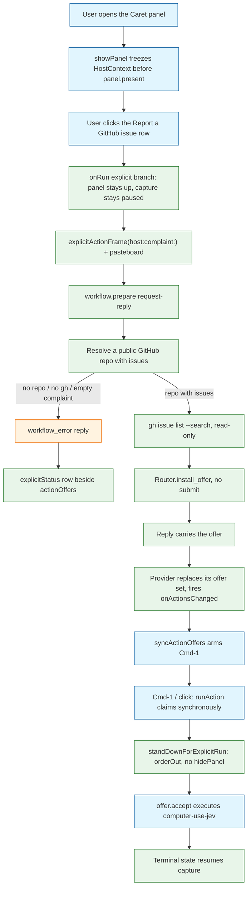

# Task: caret-report-github-issue

* Task ID: caret-report-github-issue
* Complexity: Level 3
* Type: feature

A Caret action the user picks from the panel to pause and report a problem with the app they were just in. The workflow reads the complaint from an explicitly captured context frame, resolves that app's public GitHub repository, searches its issues read-only with `gh`, and mints one offer: comment on a match, or open a new issue. The accepted write runs through computer-use-jev. An app with no public GitHub issue target fails fast with an explicit sentence.

This is replan 5. Preflights 1–4 each found one more hole in the Mac invoke path after the previous one was patched. This pass traces the whole path in the current source rather than folding the last finding, so the specification below names every step that can drop the host app, hide the accept UI, poison completions, race the ambient router, or cover Jev.

## Pinned Info

### Report flow

The user-visible path, end to end. Pinned because every unit below is a segment of it.



### Why the explicit path must not touch the ambient queue

Pinned because four of the five failure clusters live in the gap between these two lanes.

```mermaid
sequenceDiagram
    participant App as CaretApp
    participant Prov as CoreBridgeProvider
    participant Br as Bridge
    participant Eng as Engine
    participant Rt as Router
    participant Ad as ReportGithubIssueWorkflow

    App->>App: showPanel pauses capture (no context.update while open)
    App->>Prov: prepareWorkflow(id, explicit frame)
    Prov->>Br: workflow.prepare (request-reply)
    Br->>Eng: prepare_named(id, frame)
    Eng->>Ad: prepare(frame)
    alt WorkflowError
        Ad-->>Eng: raise
        Br-->>Prov: ok:false, code workflow_error
        Prov-->>App: throw; explicitStatus row
    else Preparation
        Eng->>Rt: install_offer(frame, offer)
        Note over Rt: bumps _highest_revision and _current_target,<br/>clears _pending, invalidates the old offer,<br/>never takes _in_flight
        Br-->>Prov: ok:true, {offer}
        Prov->>Prov: drop non-executing offers, insert this one
        Prov-->>App: onActionsChanged -> syncActionOffers -> Cmd-1 armed
    end
```

## Component Analysis

### Affected Components

#### Python core

- `caret/live_workflows/github.py` (new): injectable read-only `gh` port plus pure resolution logic. Owns `NotOpenSource`, `NoComplaint`, `GhMissing` — all subclasses of `caret.registry.WorkflowError`, so `Bridge._handle_line` already maps them to the `workflow_error` code. Owns the non-GitHub-tracker extension-point comment.
- `caret/live_workflows/report_issue.py` (new): `ReportGithubIssueWorkflow`. Descriptor `execution_method="computer-use-jev"`, `sample_only=False`, and `prepare` never returns `missing_inputs`. All three matter: `CaretActionOffer.isExecutable` requires a non-placeholder method, `sample_only == false` and empty `missing_inputs`, and `visibleExecutableActions` filters on `isExecutable`, so any other combination makes the offer invisible to Cmd-1. `availability` is False unless the frame carries a `SourceRecord(name="explicit_invoke", available=True)`, keeping the id out of `registry.choices()` for a jev/gateway judge. `execute` mirrors `NativeComputerUseWorkflow`: pop a token, refuse unless `preparation`, `frame.snapshot` and age all match, then run a **templated** goal — never the raw complaint as a free-form goal.
- `caret/router.py`: new `Router.install_offer(frame, offer)`.
- `caret/engine.py`: new `Engine.prepare_named(workflow_id, frame)`.
- `caret/bridge.py`: new `workflow.prepare` request-reply method; `build_registry` registers the adapter as a built-in and adds its id to the `seeds_from_catalog` skip set.
- `caret/workflows.json`, `caret/live_workflows/actions.py`, `caret/live_workflows/__init__.py`: catalog row, action table, lazy export.
- `caret/skills/report-github-issue/default.json` and `caret/notes/skills/report-github-issue.md`: picker identity.

#### Mac app

- `apps/mac/Sources/Caret/SkillActionRunner.swift`: add `ExplicitInvokeActions`, a sibling of the existing `GatewaySkillActions` enum in the same file. `SkillActionRunner` itself gains nothing — it holds no bridge and must not spawn one.
- `apps/mac/Sources/Caret/CaretApp.swift`: `Model` explicit-session state and the browse-panel status row; `AppDelegate` host freeze, explicit `onRun` branch, click-outside suppression, accept-time stand-down and post-run resume.
- `apps/mac/Sources/Caret/CoreBridgeProvider.swift`: `prepareWorkflow`, offer-set replacement, and a no-field branch in `runAction`.
- `apps/mac/Sources/CaretCore/CoreBridgeClient.swift`: `prepareWorkflow` request encoding.
- `apps/mac/Sources/CaretCore/FocusedTargetCapture.swift`: `HostContext` and `explicitActionFrame(host:complaint:)`.

#### Docs

- `docs/bridge-protocol.md`, `docs/live-workflow-adapters.md`, `docs/input-pipeline.md`.

### Cross-Module Dependencies

- `showPanel` → `hostContext` → `onRun` explicit branch → `explicitActionFrame` → `CoreBridgeProvider.prepareWorkflow` → `CoreBridgeClient` → `Bridge._prepare` → `Engine.prepare_named` → adapter `prepare` → `Router.install_offer` → reply → provider offer set → `onActionsChanged` → `AppDelegate.syncActionOffers` → `model.actionOffers` **and** `inlineCompletion.setVisibleChoiceCount` → Cmd-1 → `model.onRunAction` → `CoreBridgeProvider.runAction` → `offer.accept` → `Engine.accept` → `Router.accept` → adapter `execute` → computer-use-jev.
- `syncActionOffers` is the single writer of `model.actionOffers` and the single place Cmd-1 is armed. Anything that sets `model.actionOffers` directly is overwritten by the next offer event and never arms the chord.
- `Router.accept` compares the acceptance target against both `offer.target` **and** `_current_target`. `_current_target` moves only on `submit` and `install_offer`, so the explicit offer stays acceptable exactly as long as no ambient `context.update` lands — which is why capture must stay paused for the whole session.

### Boundary Changes

- New bridge method `workflow.prepare` (request-reply, no event).
- New `Router.install_offer` and `Engine.prepare_named`.
- New built-in workflow on the default Mac bridge, with a `workflows.json` row and a catalog-seed skip.
- New `ExplicitInvokeActions` branch in `Model.selectActionFromPanel`, `Model.run(skill:)` and `AppDelegate.onRun`.
- New public `HostContext` and `FocusedTargetCapture.explicitActionFrame(host:complaint:)`.
- New no-field branch in `CoreBridgeProvider.runAction`, keyed on an empty `elementID` and `windowID`.
- `actions.adapters()` gains a third adapter, so `tests/test_live_workflows.py::test_the_action_table_matches_the_registered_ids` changes.

### Invariants and Constraints

- `prepare` must not send, write or navigate. Only `gh` reads.
- `execute` runs only from an accepted offer whose preparation token, snapshot and age all still match.
- Never invent a repository, an issue number or a fact. A failed lookup is a visible sentence, not a guess.
- Writes go only through computer-use-jev, driven by a templated goal chosen in code, never by model- or user-supplied free text.
- Not-open-source, empty complaint and missing `gh` are `workflow_error` replies. No `failed` event on this path: `CoreBridgeProvider.handle(.failed)` sets `unavailableText` and disables inline completions, which is a completion-backend outage, not a skill outcome.
- The panel stays visible and capture stays paused from the moment the action is picked until the offer is accepted or the session is cancelled.
- After acceptance the panel is ordered out before Jev runs, without `hidePanel`.
- Capture is resumed exactly once, on the run's terminal state.
- The explicit offer is the only offer while the session is live, so Cmd-1 is deterministic.
- No GitHub REST client, no `gh issue create` happy path, no `--frame` CLI, no second bridge, no `CaretCLI` source-string test.
- Non-GitHub trackers stay a code comment, not a code path.

## Open Questions

- [x] GitHub I/O → `gh` search in prepare; computer-use-jev write after accept
- [x] Invoke → picker row + `workflow.prepare` request-reply + existing `offer.accept`
- [x] App → repo → evidenced GitHub URL in the complaint, else `gh search repos` on `frontmost_app`
- [x] Mac frame → `explicitActionFrame(host:complaint:)`, pasteboard always read
- [x] Accept without a text field → pid and bundle id only
- [x] Default registry → built-in in `build_registry`, seed skipped
- [x] Host app after the picker opens → `HostContext` frozen in `showPanel` before `present`
- [x] Visible failure → `Model.explicitStatus` row beside `actionOffers`
- [x] Invoke click count → one click; `selectActionFromPanel` runs the action instead of scoping, so `filteredSkills` is never on the path
- [x] Cmd-1 arming → the reply offer is installed in the provider's own store so `onActionsChanged` reaches `syncActionOffers`
- [x] Panel over Jev → `standDownForExplicitRun` orders out after the synchronous claim
- [x] Search field text → `Model.trimmedPanelQuery` is the complaint when non-empty

## Test Plan (TDD)

### Behaviors to Verify

#### `caret/live_workflows/github.py`

- Complaint text containing a `github.com/<owner>/<repo>` URL → that repo, `evidence == "url"`, no `gh search repos` call
- No URL, `frontmost_app` detail set → `gh search repos` is called with that display name, first public non-archived result with issues enabled wins, `evidence == "gh-search"`
- No URL and no usable search result → raises `NotOpenSource` carrying the sentence
- Complaint empty after trimming nearby text and clipboard → raises `NoComplaint`
- `gh` not on PATH → raises `GhMissing`
- Issue search returns a match → `recommend` returns comment mode with that issue
- Issue search returns nothing → `recommend` returns new-issue mode

#### `caret/live_workflows/report_issue.py`

- `prepare` on a resolvable frame → `Preparation` with empty `missing_inputs` and a payload carrying `token`, `mode`, `repo_slug`, `repo_source`; no subprocess is spawned
- `descriptor.execution_method == "computer-use-jev"` and `descriptor.sample_only is False`
- `availability` on a frame with no `explicit_invoke` source → `Availability(False, …)`; with the source and a configured binary and key → available
- `execute` with a matching preparation → spawns the executor exactly once, with a goal built from the template, not from the complaint
- `execute` with an unknown, expired or tampered token, or a changed `frame.snapshot` → `failed`, nothing spawned
- `execute` with `payload["repo_source"]` outside `{"url", "gh-search"}` → `failed`, nothing spawned
- Executor missing → `prepare` still succeeds when it was invoked explicitly; `execute` returns `failed`

#### `caret/router.py`

- `install_offer` leaves `_pending` None and `_in_flight` untouched; a following `take_due` returns None for that frame
- `install_offer` sets `_current_target` and `_highest_revision` from the frame, so a subsequent `accept` with the offer's own target succeeds
- `install_offer` emits `invalidated` for a previously current offer
- An ambient evaluation already in flight that calls `complete_offer` after `install_offer` publishes `discarded`, and `current_offer` is still the installed one
- `install_offer` with a revision not above `_highest_revision` raises

#### `caret/engine.py`

- `prepare_named` returns the offer and does not call `submit`, `complete_offer` or `complete_failure`
- `prepare_named` on an unregistered id raises `WorkflowError`
- A `WorkflowError` from the adapter's `prepare` propagates unchanged

#### `caret/bridge.py`

- `workflow.prepare` success → one reply on the same id carrying `{"offer": …}`, and no event line
- `workflow.prepare` on a not-open-source frame → `ok:false`, code `workflow_error`, the sentence as the message, and no `failed` event
- `build_registry(fixture, db)` with no `--adapter` → `report-github-issue` resolves to `ReportGithubIssueWorkflow`, not `UnavailableWorkflow`

#### Mac

- `explicitActionFrame` returns a frame whose revision is above the previous `capture()` revision and below the next one
- `explicitActionFrame` carries pasteboard text when `configuration.clipboardEnabled` is false and the pasteboard holds text
- `explicitActionFrame` with a non-empty complaint puts it in `nearbyText` with a consistent `caret`, `textOffset`, `selection` and `valueLength`
- `explicitActionFrame` with no focused field encodes an empty-string `windowID` and `elementID` and a legal snapshot: the JSON has `nearby_text`, `role`, `captured_at` and `value_length`
- `explicitActionFrame` carries `explicit_invoke` and `frontmost_app` source records, both with a null `captured_at`
- `CoreBridgeProvider.hostMismatch` → nil when pid and bundle id match a live host; a sentence when the pid is gone, terminated, or the bundle id differs
- `CoreBridgeClient` encodes `workflow.prepare` with `workflow_id` and `frame`, and decodes an `{"offer": …}` reply into an `ActionOffer`
- An `ok:false` `workflow_error` reply to `workflow.prepare` surfaces as `BridgeError.core(code:"workflow_error", …)`

### Test Infrastructure

- Framework: `unittest` under `pytest`, plus `XCTest` for Swift.
- Test location: `tests/` for Python; `apps/mac/Tests/` and `apps/mac/Tests/CaretCoreTests/` for Swift.
- Conventions: one `unittest.TestCase` subclass per behavior cluster, sentence-shaped test names, helpers such as `frame(...)` and `Clock` from `tests/live_support.py`; Swift tests use pure `nonisolated static` functions and `FakeTransport` rather than a live process.
- New test files: `tests/test_report_issue.py`, `tests/test_report_issue_workflow.py`.
- Modified test files: `tests/test_router.py`, `tests/test_engine.py`, `tests/test_bridge.py`, `tests/test_live_workflows.py` (the action-table assertion gains the third id), `apps/mac/Tests/ActionAcceptanceTests.swift`, `apps/mac/Tests/CaretCoreTests/CoreJSONShapeTests.swift`, `apps/mac/Tests/CaretCoreTests/CoreBridgeClientTests.swift`.
- Not to be written: no test that asserts on `CaretCLI` source strings; no test that asserts on SwiftUI view bodies; no test whose only failure mode is someone editing a document.

### Integration Tests

- `tests/test_bridge.py`: drive a real `Bridge` over string buffers with a stub adapter registered, send `workflow.prepare` then `offer.accept`, and assert the reply sequence and the absence of any `failed` event.
- `tests/test_router.py`: `submit` an ambient frame, take it due, `install_offer` a newer explicit frame, then `complete_offer` the ambient one and assert it is discarded while the installed offer survives and is acceptable.

## Implementation Plan

### 1. GitHub read port — executable

- Files: `caret/live_workflows/github.py`, `tests/test_report_issue.py`

1. Stub tests: in `tests/test_report_issue.py`, empty cases for URL wins, `frontmost_app` search wins, not-open-source raises, empty complaint raises, missing `gh` raises, match recommends a comment, no match recommends a new issue.
2. Stub interface: `Repo`, `IssueMatch`, `GhPort` protocol, `SubprocessGh`, `NotOpenSource`, `NoComplaint`, `GhMissing`, `NOT_OPEN_SOURCE_SENTENCE`, `complaint_from(frame)`, `display_name(frame)`, `repo_from_text(text)`, `resolve_repo(frame, gh)`, `search_issues(gh, repo, complaint)`, `recommend(matches, complaint)`. Add the module comment naming the later non-GitHub tracker hook: a new `Tracker` port would slot in beside `GhPort`, with `resolve_repo` returning a tracker-agnostic target.
3. Write tests and run red: a fake `GhPort` records its calls; assert the URL case never calls `search_repos`, assert the sentence text, assert `Repo.evidence`.
4. Write code and run green: `complaint_from` uses trimmed `frame.snapshot.nearby_text`, falling back to `frame.clipboard.text` when the clipboard is available; `display_name` reads the `frontmost_app` source record's `detail` and falls back to the bundle-id tail; `SubprocessGh` runs `gh search repos` and `gh issue list --repo … --search … --state all --json number,title,url,state --limit 5` with a timeout, and nothing else.

### 2. Workflow adapter — executable

- Files: `caret/live_workflows/report_issue.py`, `tests/test_report_issue_workflow.py`

1. Stub tests: empty cases for descriptor fields, availability with and without the `explicit_invoke` source, prepare spawns nothing, prepare raises the three typed errors, execute spawns once with a templated goal, execute refuses an unknown or expired token, execute refuses a changed snapshot, execute refuses a bad `repo_source`.
2. Stub interface: `WORKFLOW_ID = "report-github-issue"`, `EXPLICIT_SOURCE = "explicit_invoke"`, `GOAL_NEW`, `GOAL_COMMENT`, and `ReportGithubIssueWorkflow` with `descriptor`, `availability`, `prepare`, `execute`, `cancel` and an injectable `gh`, `environ`, `clock` and `timeout`.
3. Write tests and run red: inject a fake `GhPort` and a fake spawn hook; assert `descriptor.execution_method == "computer-use-jev"`, `descriptor.sample_only is False`, `prepare(...).missing_inputs == ()`, and that the goal string passed to the executor is one of the two templates with only the slug or issue URL interpolated.
4. Write code and run green: `availability` returns False with a reason unless `EXPLICIT_SOURCE` is present and available, then applies the same binary, key and Accessibility checks `NativeComputerUseWorkflow.availability` uses. `prepare` raises the typed errors, searches, and returns a `Preparation` whose payload carries `token`, `mode`, `repo_slug`, `repo_source`, `issue_url` and `complaint`; it records `self.pending[token] = (clock(), frame.snapshot, preparation)` and prunes entries older than 30 s. `execute` pops the token, refuses on mismatch or a `repo_source` outside `{"url", "gh-search"}`, then runs the executor with the same subprocess, timeout, SIGINT, trace-bound and key-redaction handling as `NativeComputerUseWorkflow.execute`.

### 3. Built-in registration and picker identity — executable

- Files: `caret/bridge.py`, `caret/workflows.json`, `caret/live_workflows/actions.py`, `caret/live_workflows/__init__.py`, `caret/skills/report-github-issue/default.json`, `caret/notes/skills/report-github-issue.md`, `tests/test_bridge.py`, `tests/test_live_workflows.py`

1. Stub tests: in `tests/test_bridge.py`, an empty case asserting `build_registry(fixture, db)` with no adapter specs resolves `report-github-issue` to `ReportGithubIssueWorkflow`. In `tests/test_live_workflows.py`, extend `test_the_action_table_matches_the_registered_ids` with the new id.
2. Stub interface: add the `report-github-issue` row to `caret/workflows.json`; add `"ReportGithubIssueWorkflow": "report_issue"` to `_LAZY`; add the action-table and `ADAPTER_CLASS_PATHS` entries and the third instance in `actions.adapters()`.
3. Write tests and run red: assert `isinstance(registry.get("report-github-issue"), ReportGithubIssueWorkflow)` and that the registered-id list is the three ids.
4. Write code and run green: in `build_registry`, `registry.register(ReportGithubIssueWorkflow())` before the seed loop, and widen the skip to `frozenset({"book-calendar-link", "report-github-issue"})` so `seeds_from_catalog` does not raise on the duplicate id or shadow the adapter with an `UnavailableWorkflow`. Write `caret/skills/report-github-issue/default.json` with `name` and `description` in the shape `SkillRepository.loadSkill` reads, and `caret/notes/skills/report-github-issue.md` so a fresh Application Support store seeds the action too.

### 4. install_offer, prepare_named and workflow.prepare — executable

- Files: `caret/router.py`, `caret/engine.py`, `caret/bridge.py`, `tests/test_router.py`, `tests/test_engine.py`, `tests/test_bridge.py`

1. Stub tests: in `tests/test_router.py`, empty cases for pending cleared, `take_due` None, target and revision moved, old offer invalidated, in-flight ambient discarded, revision-not-newer raises. In `tests/test_engine.py`, empty cases for the returned offer, no `submit`, unregistered id raises, adapter error propagates. In `tests/test_bridge.py`, empty cases for the success reply, the `workflow_error` reply and the absence of a `failed` event.
2. Stub interface: `Router.install_offer(self, frame: ContextFrame, offer: Offer) -> Offer`; `Engine.prepare_named(self, workflow_id: str, frame: ContextFrame) -> Offer`; `Bridge._prepare(self, params: dict) -> dict` plus the `workflow.prepare` dispatch arm.
3. Write tests and run red: spy on `on_invalidate` and `on_publish` to assert exactly which lifecycle callbacks fire.
4. Write code and run green.
   - `install_offer` takes `_lock`, raises `WorkflowError` when `frame.revision <= self._highest_revision`, then sets `_highest_revision` and `_current_target` from the frame, sets `_pending = None`, calls `_invalidate_locked("replaced-by-explicit-invoke")` and assigns `_offer`. It does not touch `_in_flight`, `_last_started`, `_failed_at`, `_suppressed` or `_consumed`, and it does not consult `suppression_reason` or the cadence. Moving `_highest_revision` and `_current_target` is what makes any ambient evaluation already in flight fail `is_stale`, so its `complete_offer` publishes `discarded` instead of overwriting the installed offer.
   - `prepare_named` calls `registry.get`, then `adapter.prepare(frame)`, then `build_action_offer`, then `install_offer`, and returns the offer. It does not call `availability`: the availability gate exists only to keep the id out of `registry.choices()`.
   - `Bridge._prepare` validates a non-empty string `workflow_id`, parses the frame with `ContextFrame.from_dict`, and replies `{"offer": offer.to_dict()}`. The dispatch arm must **not** call `self._wake.set()`. `WorkflowError` reaches the existing handler and becomes `workflow_error`; `ContextError` becomes `invalid_context`.

### 5. Mac explicit invoke — executable

- Files: `apps/mac/Sources/CaretCore/FocusedTargetCapture.swift`, `apps/mac/Sources/CaretCore/CoreBridgeClient.swift`, `apps/mac/Sources/Caret/CoreBridgeProvider.swift`, `apps/mac/Sources/Caret/SkillActionRunner.swift`, `apps/mac/Sources/Caret/CaretApp.swift`, `apps/mac/Tests/CaretCoreTests/CoreJSONShapeTests.swift`, `apps/mac/Tests/CaretCoreTests/CoreBridgeClientTests.swift`, `apps/mac/Tests/ActionAcceptanceTests.swift`

1. Stub tests: empty cases for the revision sequence, the pasteboard read with `clipboardEnabled` false, the complaint-in-`nearbyText` offsets, the no-field snapshot JSON shape, the two source records, `hostMismatch` in four states, and the `workflow.prepare` encode and decode over `FakeTransport`.
2. Stub interface:
   - `public struct HostContext: Equatable, Sendable { public let pid: pid_t; public let bundleID: String; public let localizedName: String }` in `FocusedTargetCapture.swift`.
   - `public func explicitActionFrame(host: HostContext, complaint: String, now: Date = Date()) -> ContextFrame` and a private `nextRevision()` used by both it and `snapshot(from:)`.
   - `public func prepareWorkflow(workflowID: String, frame: ContextFrame) async throws -> ActionOffer` on `CoreBridgeClient`, with private `PrepareParams` (`workflow_id`, `frame`) and `PrepareResult` (`offer`).
   - `func prepareWorkflow(id: String, frame: ContextFrame) async throws -> CaretActionOffer`, `struct HostSnapshot { let pid: pid_t; let bundleID: String; let terminated: Bool }` and `nonisolated static func hostMismatch(offerTarget: TargetIdentity, host: HostSnapshot?) -> String?` on `CoreBridgeProvider`.
   - `enum ExplicitInvokeActions { static let ids: Set<String> = ["report-github-issue"]; static func contains(_:) -> Bool }` in `SkillActionRunner.swift`.
   - On `Model`: `@Published private(set) var explicitStatus: String`, `@Published private(set) var explicitPrepareInFlight: Bool`, `private(set) var explicitSessionActionID: String?`, and `beginExplicitInvoke(actionID:)`, `failExplicitInvoke(_:)`, `finishExplicitInvoke()`.
   - On `AppDelegate`: `private var hostContext: HostContext?`, `runExplicitInvoke(action:model:)`, `standDownForExplicitRun()`, `resumeAfterExplicitRun(summary:)`.
3. Write tests and run red: `hostMismatch` and the encoder are pure, so they are asserted directly; the JSON shape test decodes the encoded frame back into a dictionary and asserts the keys Python's `InputSnapshot.from_dict` requires (`revision`, `captured_at`, `target`, `role`, `nearby_text`, `text_offset`, `caret`).
4. Write code and run green, in this order.
   - **`FocusedTargetCapture.explicitActionFrame(host:complaint:)`.** Take `nextRevision()` from the same lock-guarded counter `snapshot(from:)` uses, so explicit and ambient revisions form one monotonic sequence — `Router._highest_revision` is shared between them. Choose the text: a non-empty `complaint` wins; otherwise the focused field's value via `liveTarget(allowingCaretPanelForPID: host.pid)` when its `target.pid == host.pid`; otherwise `""`. Bound the text to `configuration.nearbyTextLimit`. Set `textOffset = 0`, `caret` and `selection` to the UTF-16 length of the text, `valueLength` to the same, and `role` to the live field's role or `""`. Use the live field's `TargetIdentity` when a field was used, otherwise `TargetIdentity(pid: host.pid, bundleID: host.bundleID, windowID: "", elementID: "", elementRevision: "")` — the two empty strings are the discriminator `runAction` keys its no-field branch on. Read `NSPasteboard.general.string(forType: .string)` unconditionally, bounded to `CoreLimits.clipboardUnits`; do not change `clipboardContext(now:)` or the `clipboardEnabled` default, which the ambient path still owns. Attach `SourceRecord(name: "explicit_invoke", available: true, capturedAt: nil, detail: host.bundleID)`, `SourceRecord(name: "frontmost_app", available: true, capturedAt: nil, detail: host.localizedName)` and a clipboard record. Every `capturedAt` is nil so `ContextFrame.stale_sources` can never suppress this frame.
   - **`CoreBridgeClient.prepareWorkflow`.** One `send`, no event handling.
   - **`CoreBridgeProvider.prepareWorkflow`.** Factor the `CaretActionOffer` construction currently inline in `handle(.offer(.action))` into a `private static func record(from: ActionOffer) -> CaretActionOffer` and use it from both. On success, set `actionOffers = actionOffers.filter { executing.contains($0.key) }` before inserting the new record, then call `onActionsChanged?()`. Both halves are load-bearing: `visibleExecutableActions` sorts by `proposalID`, so leaving an ambient offer in the store would let it take Cmd-1; and `onActionsChanged` is the only thing that reaches `AppDelegate.syncActionOffers`, which is the only place `setVisibleChoiceCount` is armed. Setting `model.actionOffers` directly would be overwritten by the next offer event and would never arm the chord.
   - **`CoreBridgeProvider.runAction`.** Branch before the existing revalidation: when `offer.target.elementID.isEmpty && offer.target.windowID.isEmpty`, call `hostMismatch(offerTarget:host:)` built from `NSRunningApplication(processIdentifier: offer.target.pid)` and finish as `.unavailable` on a sentence; otherwise keep the existing `liveTarget` and `staleness` path unchanged. Either way, send `offer.target` to `offer.accept` — `Router.accept` compares it against both the stored offer and `_current_target`, and a rebuilt live-field target would match neither.
   - **`ExplicitInvokeActions`** in `SkillActionRunner.swift`. `SkillActionRunner.run` is untouched and still refuses non-gateway ids; nothing on the explicit path calls it.
   - **`Model`.** Add the three published properties and the three mutators. In `selectActionFromPanel`, branch on `ExplicitInvokeActions.contains(action.id)` **before** the gateway branch and call `run(action, skill: nil)` without setting `scopedActionID` — one click, and `filteredSkills` never enters the path, which is what made the previous status-row placement invisible. Add the same branch to `run(skill:)` keyed on `skill.actionID`, so the pinned and scoped routes reach the same place. Clear the explicit state in `preparePanel(scopedActionID:)` and `clearPanelScope()` so a stale sentence never reappears in a new session.
   - **`SkillPickerView.browsePanel`.** Inside the header `VStack(alignment: .leading, spacing: 8)`, immediately above the `if !model.actionOffers.isEmpty` block, render `CaretActionStatusRow` when `!model.explicitStatus.isEmpty`. That header renders in both the scoped and unscoped states and does not depend on `filteredSkills`, `backendStatus` or `unavailabilityText(for:)`. Do not use `failSkillPreview`, which only renders inside `GatewayActionPanel`, and do not write `backendStatus`, which the inline status owns.
   - **`AppDelegate.showPanel`.** As the first statement, before `trigger.hide()` and before `panel?.present`, set `hostContext` from `NSWorkspace.shared.frontmostApplication` when that app is not Caret, keeping the previous value otherwise. `SelectionMonitor.inspect` publishes nil as soon as Caret is frontmost and `lastTarget` follows it within about 200 ms, so the host must be captured here or it is gone.
   - **`AppDelegate.onRun`.** Move the `ExplicitInvokeActions` branch above the existing `freshTargetForGatewayAction()` call, which calls `monitor.refreshNow()` and would churn `lastTarget`. The branch calls `runExplicitInvoke` and returns, so it never reaches `hidePanel()` — `hidePanel` unpauses capture, clears the panel scope and re-activates the host, and the next capture tick would fire `onContextInvalidated` and drop the offer before it arrives.
   - **`AppDelegate.runExplicitInvoke(action:model:)`.** Refuse with a sentence when `hostContext` is nil. Otherwise `model.beginExplicitInvoke(actionID:)`, build the frame with `capture.explicitActionFrame(host:complaint: model.trimmedPanelQuery)`, and `await bridge?.prepareWorkflow(id:frame:)`. On success call `model.finishExplicitInvoke()` and let the offer row carry the UI. On `BridgeError.core(_, let message)` call `model.failExplicitInvoke(message)`; on anything else use a fixed sentence. The panel is never hidden and capture is never unpaused here.
   - **`AppDelegate.installClickOutside`.** Return early from the click handler while `model?.explicitPrepareInFlight == true`, so a click during the `gh` wait cannot hide the panel and strand an armed offer behind it. Escape still calls `hidePanel`, which is the deliberate cancel.
   - **`AppDelegate` accept path.** Wrap `model.onRunAction` so it reads `bridge?.actionOffer(id:)?.workflowID` first, calls `bridge?.runAction(proposalID:)` — whose claim into `executing` is synchronous and taken before any await — and then, for an explicit workflow id, calls `standDownForExplicitRun()`: `panel?.orderOut(nil)`, `panel?.resignKey()`, `removeClickOutside()`, `inlineCompletion?.setVisibleChoiceCount(0)`. Deliberately not `hidePanel()`: `CaretPanel.level` is `.floating`, so the panel would otherwise sit over the browser Jev is driving, while `hidePanel`'s `setPaused(false)`, `clearPanelScope()` and `restoreTypingAppFocus()` would resume capture and re-activate the host mid-run.
   - **`AppDelegate` resume.** In the `provider.onActionStateChange` handler, when the proposal is the explicit one and the state is `.succeeded`, `.failed`, `.cancelled` or `.unavailable`, call `resumeAfterExplicitRun(summary:)`: `inlineCompletion?.setPaused(false)`, `model?.clearPanelScope()`, `trigger.update(target: lastTarget)`, `tabCompletions.update(target: lastTarget)`, then set `model.explicitStatus` to the run's summary so the next panel open shows what happened. This is the only place capture resumes on the accept path; without it the pause outlives the run and inline completions stay dead for the session.

### 6. Docs — prose/policy

- Files: `docs/bridge-protocol.md`, `docs/live-workflow-adapters.md`, `docs/input-pipeline.md`
- No tests: prose/policy artifact

1. `docs/bridge-protocol.md`: document `workflow.prepare` as request-reply, its params and reply shape, its error codes, and the rule that it emits no event.
2. `docs/live-workflow-adapters.md`: document the built-in registration, the explicit-invoke availability gate, the read-only `gh` prepare, the templated Jev goals and the fail-fast sentence.
3. `docs/input-pipeline.md`: document the explicit-invoke lane — host freeze, paused capture, panel stay, deterministic Cmd-1, stand-down before Jev, resume on terminal state — and its ownership boundary against the ambient lane.

## Technology Validation

No new dependencies, build-tool changes or configuration additions. `gh` is already installed at `/opt/homebrew/bin/gh` and is invoked as a subprocess through an injectable port. The executor is the already-pinned computer-use-jev binary, reached exactly as `NativeComputerUseWorkflow` reaches it.

Build-time prerequisites, all pre-existing: `CARET_PROJECT_ROOT` or the `CaretProjectRoot` Info.plist key must point at the checkout, because `CaretPaths.skillsRoot` is nil without it and the action would not appear in the picker; `CARET_COMPUTER_USE_JEV` and `TYPESAFE_API_KEY` must be set for `execute`; `gh` must be authenticated for `prepare`.

## Challenges & Mitigations

- **Host app lost when the panel opens.** `SelectionMonitor.inspect` publishes nil the moment Caret is frontmost. Mitigated by freezing `HostContext` as the first statement of `showPanel`, and by never reading `lastTarget` or `NSWorkspace.frontmostApplication` on the explicit path.
- **Accept UI hidden.** `onRun` hides the panel for every non-gateway id. Mitigated by the explicit branch returning before `hidePanel`.
- **Cmd-1 never armed.** `setVisibleChoiceCount` is only touched by `syncActionOffers`. Mitigated by installing the reply offer in the provider's own store and firing `onActionsChanged`.
- **Cmd-1 addressing the wrong offer.** `visibleExecutableActions` sorts by `proposalID`, which is a UUID. Mitigated by dropping every non-executing offer when the explicit one is installed.
- **Offer invisible despite arriving.** `isExecutable` requires empty `missing_inputs`, `sample_only == false` and a non-placeholder `execution_method`. Mitigated by pinning all three on the descriptor and by never returning `missing_inputs` from `prepare`.
- **Ambient race.** Mitigated by `install_offer` moving `_highest_revision` and `_current_target` and clearing `_pending`, so a pending frame is never evaluated and an in-flight one is discarded.
- **Accept refused as a moved target.** `Router.accept` also compares against `_current_target`. Mitigated by keeping capture paused for the whole session, so no `context.update` moves it, and by sending the offer's own target.
- **Completions poisoned.** A `failed` event sets `unavailableText` and disables inline completions. Mitigated by making every explicit failure a `workflow_error` reply and by keeping `explicitStatus` separate from `backendStatus`, so even an unrelated late `failed` cannot replace the sentence.
- **Panel over Jev.** `CaretPanel.level` is `.floating`. Mitigated by `standDownForExplicitRun` ordering out after the synchronous claim.
- **Capture paused forever.** Mitigated by `resumeAfterExplicitRun` on the terminal state.
- **Click-outside during the `gh` wait.** Mitigated by suppressing the click handler while a prepare is in flight; Escape stays the deliberate cancel.
- **Adapter absent on a default launch.** `adapters()` and `--adapter` are not on the default Mac path. Mitigated by registering the adapter in `build_registry` and skipping its catalog seed.
- **Free-form goal.** Mitigated by two goal templates chosen in code, with only a slug or an issue URL interpolated.
- **30 s acceptance window.** `max_offer_age_seconds` runs from mint, which is after `gh` returns, so the user has the full window. The `gh` calls carry their own timeout so a hung search cannot silently burn it.

## Pre-Mortem

- **We folded the last preflight bullet again and shipped the next leaf.** The plan now specifies the whole path from `showPanel` to the terminal state, naming each call site, so a builder does not have to rediscover one.
- **We treated the picker as a two-click scope-then-run.** That was the root of the invisible status row. One-click `selectActionFromPanel` removes `filteredSkills` from the path entirely, and the row now lives in header chrome that renders in both states.
- **We set `model.actionOffers` from the reply.** That is the subtlest remaining trap: it looks correct, renders correctly, and leaves Cmd-1 dead while the next ambient event silently erases the offer. Unit 5 routes the reply through the provider store and `onActionsChanged` for exactly this reason.
- **We ordered the panel out with `hidePanel` because it was the existing helper.** `hidePanel` resumes capture and re-activates the host. `standDownForExplicitRun` is a separate helper precisely so that cannot be assumed.
- **We forgot to resume capture at all, and inline completions died silently after the first report.** Covered by `resumeAfterExplicitRun`, whose absence would be invisible in any single-run demo.
- **We shipped an offer the panel filters out.** `isExecutable` is a three-part gate on fields the adapter descriptor owns; unit 2 asserts all three.
- **We used `complete_failure` for not-open-source.** Tests assert no `failed` event on this path.
- **We searched GitHub for Caret.** `HostContext` is frozen before `present` and is the only source of the display name.
- **The action never appeared in the picker on a machine with existing notes.** `CaretPaths.skillsRoot` needs a project root; both the JSON skill directory and the note are seeded, and the prerequisite is written down.
- **The complaint was empty even though the user typed one.** `model.trimmedPanelQuery` is passed as the complaint and wins over nearby text.

## Status

- [x] Component analysis complete
- [x] Open questions resolved
- [x] Test planning complete (TDD)
- [x] Implementation plan complete
- [x] Technology validation complete
- [x] Pre-Mortem complete
- [ ] Preflight
- [ ] Build
- [ ] QA
